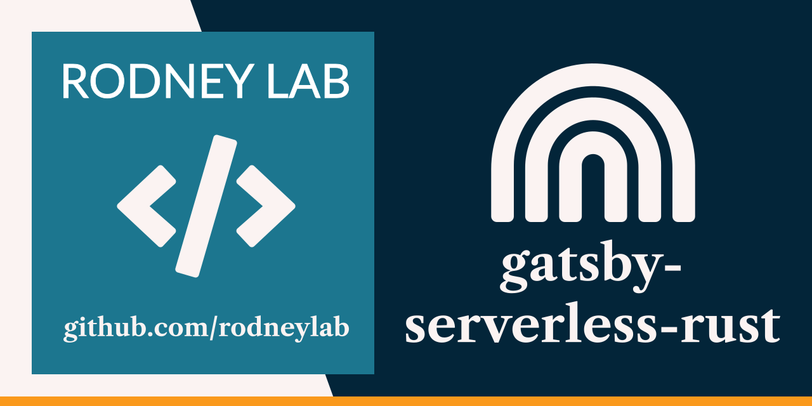

<p align="center">
  <a aria-label="Open Rodney Lab site" href="https://rodneylab.com" rel="nofollow noopener noreferrer">
    
  </a>
</p>
<h1 align="center">
  Gatsby Serverless Rust
</h1>

> **Warning**
> This repo is no longer maintained and is not recommended for use. There may security vulnerabilities in dependencies.

# gatsby-serverless-rust

[](https://open.vscode.dev/rodneylab/gatsby-serverless-rust)

See the [Use Serverless Rust with Netlify Functions blog post on the Rodney Lab site](https://rodneylab.com/use-serverless-rust-with-netlify-functions/) for more on how to set this site up. Please drop questions into a comment at the bottom of that page. There is a live demo at [gatsby-serverless-rust.rodneylab.com](https://gatsby-serverless-rust.rodneylab.com/).

Here's the quick start:

## Creating a project

If you're seeing this, you've probably already done this step. Congrats!

```bash
git clone https://github.com/rodneylab/gatsby-serverless-rust
cd gatsby-serverless-rust
npm install
gatsby develop
```

## Building

```bash
npm run build
```

> You can preview the built app with `gatsby serve`.
